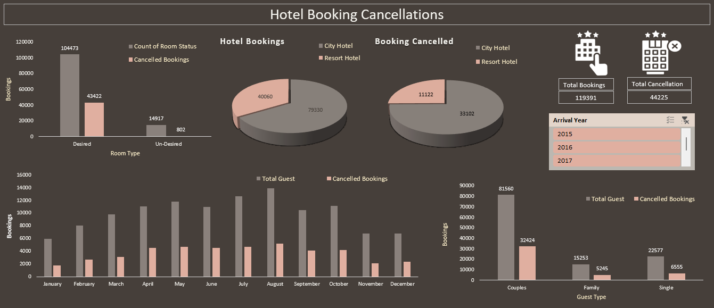

# Hotel_Booking_Cancellation_Excel_Dashboard

## Overview

This project analyzes hotel booking data to uncover patterns and insights related to booking cancellations. The analysis was conducted using Microsoft Excel, with data sourced from Kaggle. The project explores factors influencing cancellations, such as room type, hotel type, guest type, and seasonal trends.

## Project Steps

### 1. Data Cleaning
- **Tool Used:** Microsoft Power Query
- The data was cleaned to remove inconsistencies, missing values, and irrelevant fields.
- New columns were created to enhance analysis, including booking status based on room type, and categorized guest types.

### 2. Data Analysis
- **Tools Used:** Microsoft Excel (Pivot Tables, Charts)
- **Key Analyses:**
  - **Booking and Cancellation Counts:** Total bookings and cancellations were analyzed by hotel type, room type, and guest type.
  - **Seasonal Trends:** Analysis of bookings and cancellations by month.
  - **Yearly Comparison:** Trends were analyzed across the years 2015, 2016, and 2017.

### 3. Dashboard Creation
- **Tools Used:** Microsoft Excel (Advanced Features)
- **Visualizations:**
  
  - **3D Pie Chart:** Total bookings and cancellations by hotel type.
  - **Bar Charts:**
    - Count of booking status and cancellations based on desired and undesired room types.
    - Bookings and cancellations across different months of the year.
    - Bookings and cancellations by guest type (e.g., couple, family, single).
  - **Slicer:** Filter data by the years 2015, 2016, and 2017.

## Key Insights

### 1. **Overall Booking and Cancellation Trends**
   - **Total Bookings:** 
     - Resort Hotel: 40,060 bookings
     - City Hotel: 79,330 bookings
   - **Total Cancellations:**
     - Resort Hotel: 11,122 cancellations
     - City Hotel: 33,102 cancellations
   - **Insight:** City hotels have more bookings and cancellations compared to resort hotels, indicating higher activity and possibly higher volatility in city hotel bookings.

### 2. **Desired vs. Undesired Room Types**
   - **Desired Room Type:**
     - Bookings: 104,473
     - Cancellations: 43,422
   - **Undesired Room Type:**
     - Bookings: 14,917
     - Cancellations: 802
   - **Insight:** While the majority of customers received their desired room type, a significant number still canceled, suggesting that factors other than room type mismatch (e.g., pricing, schedule changes) might be driving cancellations.

### 3. **Monthly Trends**
   - **August:** 
     - Highest bookings (13,877) and highest cancellations (5,239)
   - **January:**
     - Lowest bookings (1,807) and lowest cancellations.
   - **Insight:** August seems to be the peak season for bookings and cancellations, possibly due to summer vacations or other seasonal factors.

### 4. **Guest Type Analysis**
   - **Couples:**
     - Highest in both bookings (81,560) and cancellations (32,424)
   - **Families:** 
     - Lowest in bookings (15,253) and cancellations, indicating more stable bookings.
   - **Insight:** Couples tend to book more but also cancel more, while families, though fewer in number, are more likely to follow through with their bookings.

### 5. **Year-wise Trends**
   - **2015:**
     - Highest bookings in September, with significant cancellations.
     - Couples had the highest bookings and cancellations, while families were the least active.
   - **2016:**
     - Desired bookings: 49,077, with 19,930 cancellations.
     - October had the highest bookings and cancellations.
   - **2017:**
     - Similar trends as previous years, with May having the highest bookings and cancellations.
   - **Insight:** Each year follows a similar pattern, with specific months seeing a spike in both bookings and cancellations, likely due to external factors like holidays, events, or seasonal promotions.
## Dashboard Overview
)
You can download and view the project demonstration video by [clicking here](https://github.com/NikithaMogaveer/HR_Data_Analytics_PowerBI_Dashboard/releases/download/hr-dashboard-demo-video-v1/HR_clip.mp4)

## Conclusion

The analysis provides actionable insights into booking patterns and cancellation behaviors, allowing hotels to optimize their operations, marketing strategies, and resource management.

## How to Use

1. Download the Excel file from the repository.
2. Open it in Microsoft Excel.
3. Explore the pivot tables and visualizations to understand the analysis.
4. Use the slicers to filter data by specific years.

